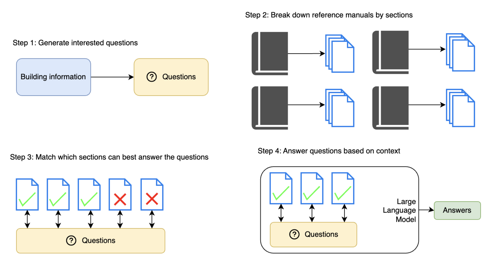
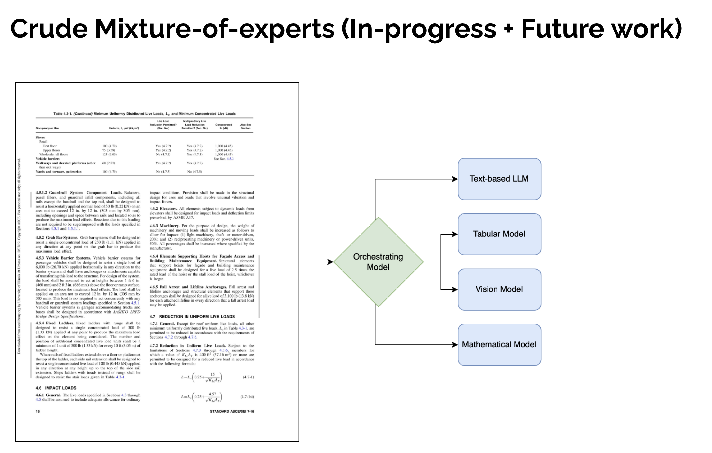

# CS-5588 Capstone Project - Group 3

Welcome to the future of Civil Engineering information access! Our project, the "Enhanced Retrieval and Generation System for Civil Engineering Reference Manuals," is here to revolutionize the way professionals interact with vast repositories of knowledge. This README is your guide to getting started with our project, so buckle up and let's embark on this technological adventure!

## Architecture

# 

## Getting Started

To run the Jupyter Notebook in `exp1.ipynb`, make sure you have the required libraries installed. You can install them using the following commands:

```bash
pip install langchain
pip install openai
pip install tiktoken
pip install PyPDF2
pip install faiss-cpu
pip install -q nougat-ocr
```

Now you're all set to dive into the exciting world of our project!

## Project Overview

### Objective

Our primary goal is to make life easier for civil engineers by developing a system that swiftly retrieves essential information from complex reference manuals. Say goodbye to flipping through thousands of pages; our system understands natural language queries and delivers precise answers.

### Key Features

- **Natural Language Querying:** Ask questions using everyday language.
- **Information Retrieval and Generation:** Extract accurate answers using cutting-edge techniques.
- **Customizable Responses:** Tailor responses based on your preferences.
- **Easy Integration:** Seamlessly integrate the system into your existing workflows through our API.

### Target Audience

This project is tailor-made for civil engineers and professionals in the field who need quick and reliable access to crucial information within reference manuals.

### Unique Selling Points

Our innovation lies in conquering the challenges of navigating extensive reference manuals. By providing rapid and accurate retrieval, we save you time and effort, boosting productivity and decision-making.

### Technologies Utilized

We employ decoder-style large language models (like GPT), vector databases for efficient storage, and FastAPI for a user-friendly API. We're also exploring the power of encoder-style LLMs (like BERT) for information retrieval and fine-tuned LLMs for specific tasks.

## Areas of exploration

# 

## How to Contribute

This project is led by the visionary Jeet Das, with guidance from the esteemed Dr. Shu-Ching Chen. We welcome contributions and feedback as we work together to make this system even more amazing.

As we progress, we'll set milestones and timelines to keep the momentum going and ensure the successful achievement of our objectives.

So, are you ready to be a part of the future of Civil Engineering information retrieval? Let's build something extraordinary together!